**Advanced Lane Finding Project**

The goals / steps of this project are the following:

* Compute the camera calibration matrix and distortion coefficients given a set of chessboard images.
* Apply a distortion correction to raw images.
* Use color transforms, gradients, etc., to create a thresholded binary image.
* Apply a perspective transform to rectify binary image ("birds-eye view").
* Detect lane pixels and fit to find the lane boundary.
* Determine the curvature of the lane and vehicle position with respect to center.
* Warp the detected lane boundaries back onto the original image.
* Output visual display of the lane boundaries and numerical estimation of lane curvature and vehicle position.

[//]: # (Image References)

[image1]: ./examples/undistort_output.png "Undistorted"
[image2]: ./test_images/test1.jpg "Road Transformed"
[image3]: ./examples/binary_combo_example.jpg "Binary Example"
[image4]: ./examples/warped_straight_lines.jpg "Warp Example"
[image5]: ./examples/color_fit_lines.jpg "Fit Visual"
[image6]: ./examples/example_output.jpg "Output"
[video1]: ./project_video.mp4 "Video"

## [Rubric](https://review.udacity.com/#!/rubrics/571/view) Points

### Here I will consider the rubric points individually and describe how I addressed each point in my implementation.  

---

### Writeup / README

#### 1. Provide a Writeup / README that includes all the rubric points and how you addressed each one.  You can submit your writeup as markdown or pdf.  [Here](https://github.com/udacity/CarND-Advanced-Lane-Lines/blob/master/writeup_template.md) is a template writeup for this project you can use as a guide and a starting point.  

You're reading it!

### Camera Calibration

#### 1. Briefly state how you computed the camera matrix and distortion coefficients. Provide an example of a distortion corrected calibration image.

While most the code for the project is in the iPython notebook PipelineJupyter.ipynb, the code for computing the camera calibration is in the python script calibrate_camera.py. This script loads all of the supplied camera calibration images, identifies the corners of the checkerboard images, generates a camera calibration and saves this calibration to camera_calibration.p which is subsequently loaded by the main iPython routine (to avoid continuously recalculating the calibration). 

  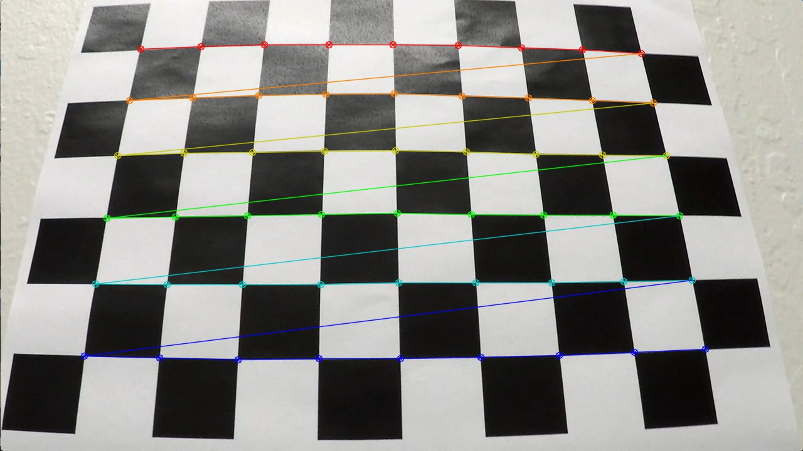 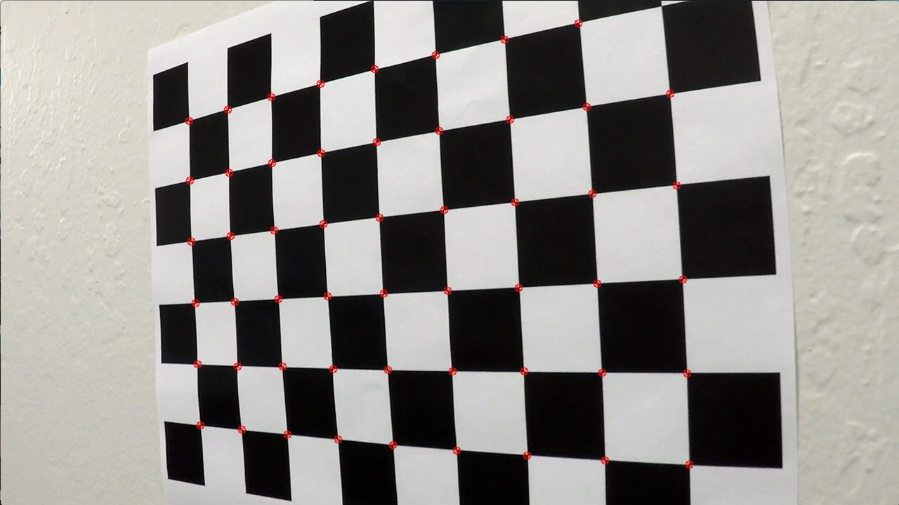
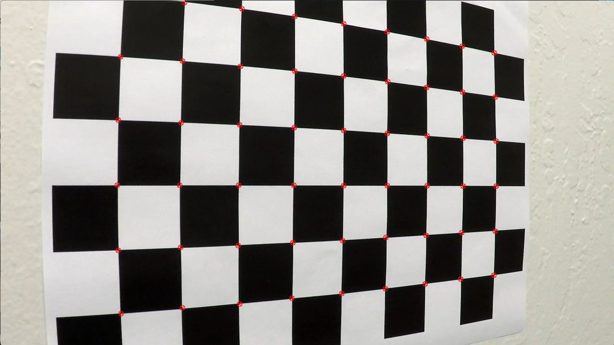  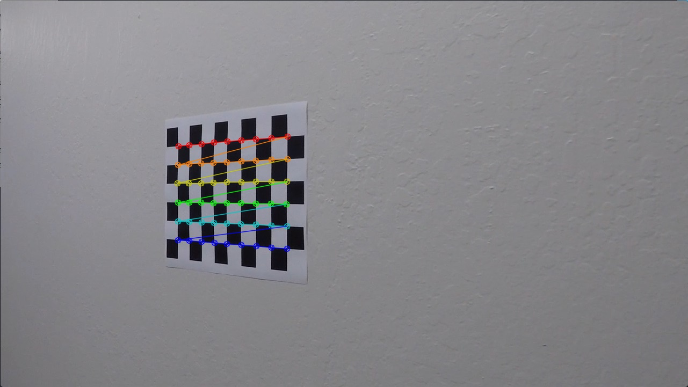 
   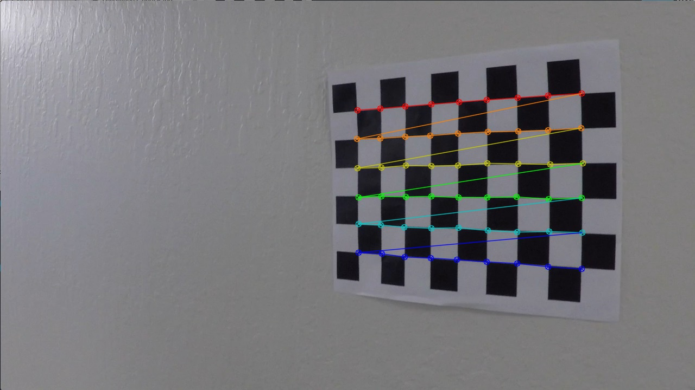
  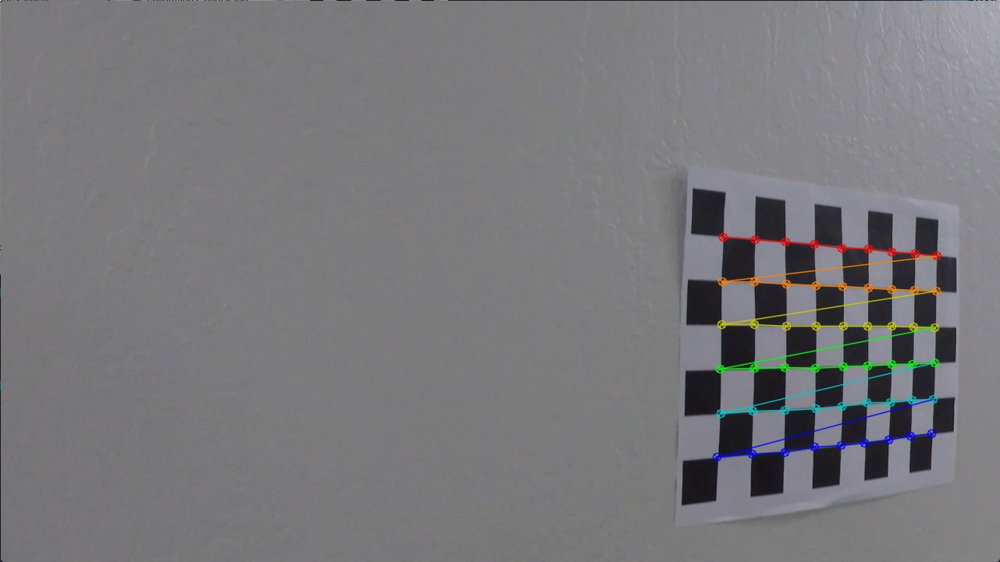 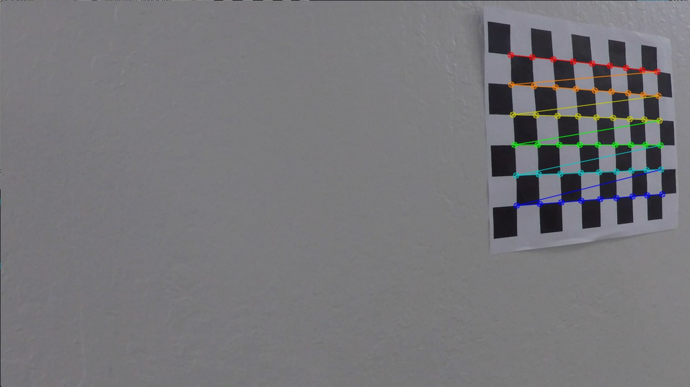
  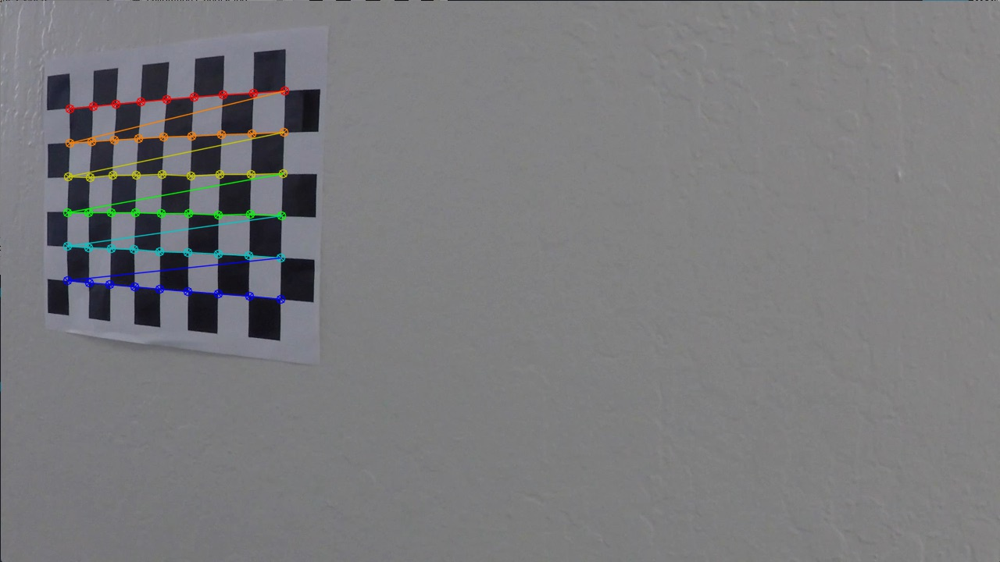 

The OpenCV algorithm was unable to identify the corners in all of the images. In this case, the image was simply not used in the calibration. A sample dewarped image is shown below.

 

### Pipeline (single images)

#### 1. Provide an example of a distortion-corrected image.

First, the camera calibration generated in the previous section was applied to the raw camera image.

 

#### 2. Describe how (and identify where in your code) you used color transforms, gradients or other methods to create a thresholded binary image.  Provide an example of a binary image result.

In order to identify the lane lines, a binary image was generated with the goal of having only the lane lines. Many different combinations of threhsold, color spaces and sobel filters were attempted but the final configuration can be found in first first section of the process() function.

The final thresholding that I used was: (HLS_L_threshold AND HLS_S_threshold) OR (SOBEL_ABS_threshold AND SOBEL_DIR_thresold)

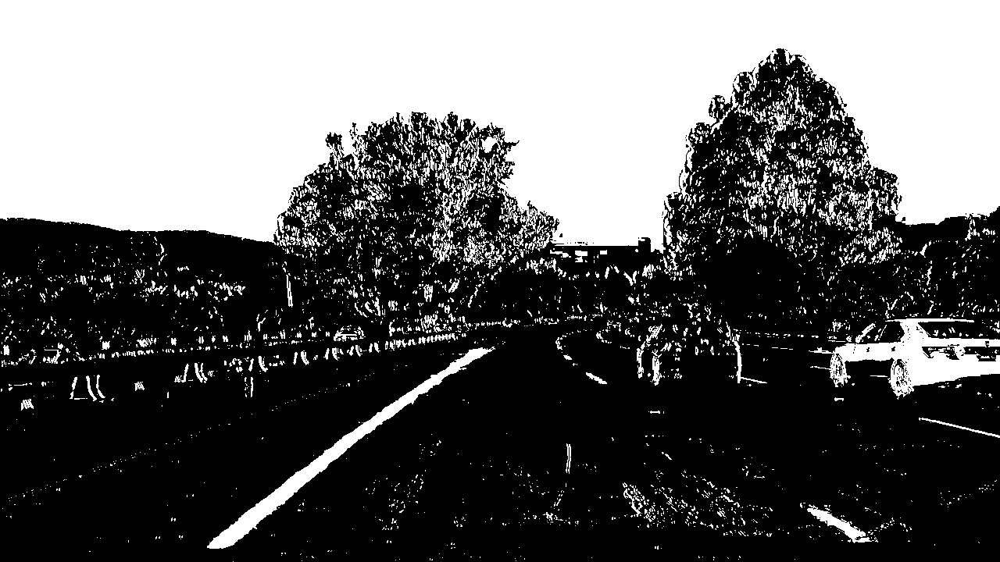

While the above image seems suboptimal, the rest of the pipeline was able to fairly robustly extract the lane lines from the images.

#### 3. Describe how (and identify where in your code) you performed a perspective transform and provide an example of a transformed image.

The code for my perspective transform includes a function called `warper()`, which appears in lines 1 through 8 in the file `example.py` (output_images/examples/example.py) (or, for example, in the 3rd code cell of the IPython notebook).  The `warper()` function takes as inputs an image (`img`), as well as source (`src`) and destination (`dst`) points.  I chose the hardcode the source and destination points in the following manner:

```python
    # Perspective transformation
    offset_x = 400
    offset_y = 0
    img_size = (img.shape[1],img.shape[0])
    src = np.float32([[607,443],[673,443],[1020,666],[285,666]])
    dst = np.float32([[offset_x, offset_y], 
                      [img_size[0]-offset_x, offset_y], 
                      [img_size[0]-offset_x, img_size[1]-offset_y], 
                      [offset_x, img_size[1]-offset_y]])

    self.M = cv2.getPerspectiveTransform(src, dst)
    self.Minv = cv2.getPerspectiveTransform(dst, src)
    x = cv2.cvtColor(binary, cv2.COLOR_GRAY2RGB)
    warped_color = cv2.warpPerspective(x, self.M, img_size)
    warped = cv2.cvtColor(warped_color, cv2.COLOR_RGB2GRAY)
```

I verified that my perspective transform was working as expected by drawing the `src` and `dst` points onto a test image and its warped counterpart to verify that the lines appear parallel in the warped image.

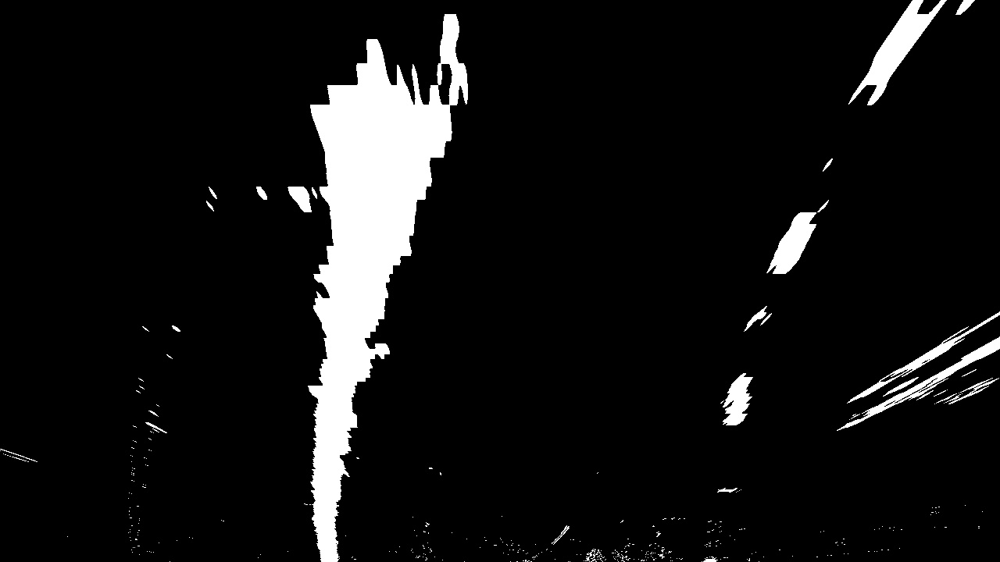 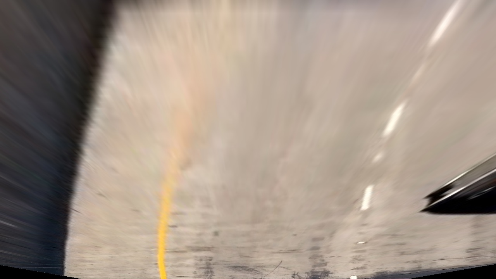


#### 4. Describe how (and identify where in your code) you identified lane-line pixels and fit their positions with a polynomial?

Then I did some other stuff and fit my lane lines with a 2nd order polynomial kinda like this:

![alt text][image5]

#### 5. Describe how (and identify where in your code) you calculated the radius of curvature of the lane and the position of the vehicle with respect to center.

I did this in lines # through # in my code in `my_other_file.py`

#### 6. Provide an example image of your result plotted back down onto the road such that the lane area is identified clearly.

I implemented this step in lines # through # in my code in `yet_another_file.py` in the function `map_lane()`.  Here is an example of my result on a test image:

![alt text][image6]

---

### Pipeline (video)

#### 1. Provide a link to your final video output.  Your pipeline should perform reasonably well on the entire project video (wobbly lines are ok but no catastrophic failures that would cause the car to drive off the road!).

Here's a [link to my video result](./project_video.mp4)

---

### Discussion

#### 1. Briefly discuss any problems / issues you faced in your implementation of this project.  Where will your pipeline likely fail?  What could you do to make it more robust?

Here I'll talk about the approach I took, what techniques I used, what worked and why, where the pipeline might fail and how I might improve it if I were going to pursue this project further.  
